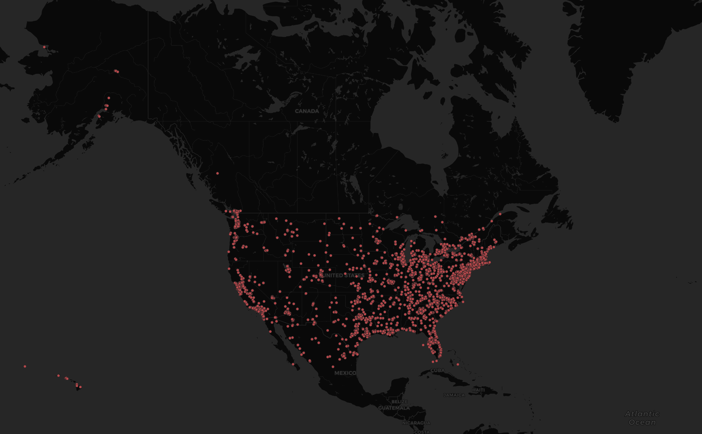

# GEOG 458 - Lab 2
##### By Connor Hynes
* * *
##Tweets Featuring the Term 'Bitcoin' in the United States

The map above features data points of Tweets collected from Twitter *(over 15 minutes)* that contain the term **"bitcoin"**. Tweets were collected using a location parameter that included only the United States. I chose the term bitcoin as there has recently been another surge in price, meaning it being spoken of a lot online. At a glance, the map does not seem to show much more than a population density analysis as most areas that a represented are the same places people live. It is hard to tell if one area is speaking about the topic more than the other, but it does seem like the Eastern half of the United States is more heavily represented than the West. However it may be that there are more points in Western cities, just that they are more concentrated in one area, and therefore do not take up us much space on the map. I think one conlusion that can be drawn from the map is that there is significantly more talk of Bitcoin in large cities/metro areas than there is in more rural areas, such as the central United States.
